<picture>
  <source media="(prefers-color-scheme: dark)" srcset="dark.svg">
  <source media="(prefers-color-scheme: light)" srcset="light.svg">
  
</picture>

# Nikhil Chauhan

**BTech CSE Student @ KL University, Vijayawada** · Full-Stack Development · AI & Algorithms

I build practical software across frontend, backend, databases, APIs and AI/algorithmic systems. I enjoy turning ideas into complete, usable applications and learning by building.

## About

- 🎓 BTech Computer Science & Engineering — KL University, Vijayawada
- 💻 Interested in full-stack engineering, backend systems, databases and AI/algorithms
- 🧠 Working with graph search, adversarial search, CSP and probabilistic reasoning
- 🛠️ Comfortable building projects across React, Spring Boot, FastAPI, Node.js and Python
- 🗄️ Working with PostgreSQL, Neon and MongoDB
- 🚀 Exploring Docker, system integration and production-style application architecture

## Featured Projects

### Workflow Approval & Review Portal
A role-based workflow system for submitting, reviewing and approving work items.

**Stack:** React.js, Vite, Spring Boot 3, Java 17, FastAPI, Node.js/Express, PostgreSQL, MongoDB, JWT, Docker Compose

**Roles:** Admin · Reviewer · Approver · Employee

### WellAxis
A healthcare platform concept connecting hospitals, clinics, doctors and patients through role-based workflows, medical history, prescriptions and appointments.

**Stack:** React/TypeScript, backend APIs, PostgreSQL/Neon and role-based application architecture

### Drone Routing AI
An AI/algorithm project for route planning around obstacles with selectable search strategies.

**Algorithms:** BFS · DFS · A* · Greedy Best-First Search

### FraudFlow
A Streamlit-based credit-card fraud detection application using a machine-learning workflow.

**Stack:** Python, Streamlit, pandas, scikit-learn, joblib

### Shellforge
A Unix-style shell project written in C, covering shell fundamentals such as tokenization, command processing and build tooling.

**Stack:** C · Makefile · Unix/Linux concepts

### Traffic Flow Analysis
A data-analysis project focused on traffic-flow data, exploratory data analysis and analytical visualisation.

**Stack:** Python · Data Analysis · EDA

## Engineering Stack

**Languages**

Java · Python · C · JavaScript · TypeScript · HTML · CSS

**Frontend**

React.js · Vite · Tailwind CSS

**Backend & APIs**

Spring Boot · FastAPI · Node.js · Express.js · REST APIs · JWT

**Databases**

PostgreSQL · Neon · MongoDB · MongoDB Atlas · pgAdmin

**DevOps & Tools**

Docker · Docker Compose · Git · GitHub · VS Code

**Algorithms & AI**

BFS · DFS · A* · GBFS · Minimax · Alpha-Beta Pruning · CSP · Bayesian Reasoning · Machine Learning

## What I Like Building

```text
Frontend        → React / TypeScript / modern UI
Backend         → Spring Boot / FastAPI / Node.js
Data            → PostgreSQL / Neon / MongoDB
AI & Algorithms → Search / CSP / probability / ML
Infrastructure  → Docker / Compose / API integration
```

## Connect

- GitHub: https://github.com/Nikhilchauhan3974
- LinkedIn: https://in.linkedin.com/in/nikhil-chauhan-b7767b360
- Email: 2500032685.cse1@gmail.com

---

<p align="center">
  <sub>Built with curiosity, code, and continuous learning.</sub>
</p>
<picture>
  <source
    media="(prefers-color-scheme: dark)"
    srcset="https://raw.githubusercontent.com/Nikhilchauhan3974/github-snake/output/github-snake-dark.svg"
  />
  <source
    media="(prefers-color-scheme: light)"
    srcset="https://raw.githubusercontent.com/Nikhilchauhan3974/github-snake/output/github-snake.svg"
  />
  
</picture>
